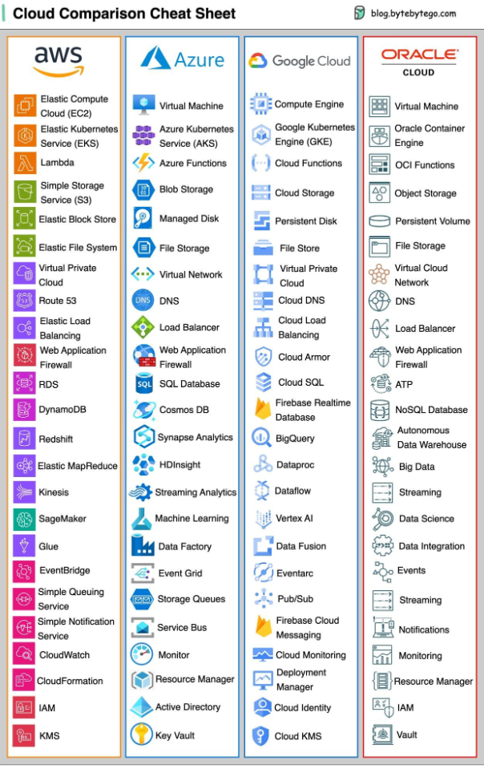

# github-docs-example


# This is Heading 1
## This is Heading 2
### This is Heading 3

---

**This is Bold**
__This is also Bold__
*This is Italic*

-----

``` bash
@nocserve03 ~]$ ping -c 4 36.255.226.1
PING 36.255.226.1 (36.255.226.1) 56(84) bytes of data.
64 bytes from 36.255.226.1: icmp_seq=1 ttl=239 time=241 ms
64 bytes from 36.255.226.1: icmp_seq=2 ttl=239 time=241 ms
64 bytes from 36.255.226.1: icmp_seq=3 ttl=239 time=241 ms
64 bytes from 36.255.226.1: icmp_seq=4 ttl=239 time=241 ms

--- 36.255.226.1 ping statistics ---
4 packets transmitted, 4 received, 0% packet loss, time 3245ms
rtt min/avg/max/mdev = 241.152/241.179/241.245/0.038 ms
```

---

This is not a quote
> This is a quote

---
Image syntax !()[]




Resize Image


---

Links and References

- https://mem.ai/m/YmNh1nMR5Htq8amF7aHD
- [Captain Obvious](https://www.google.com/url?sa=i&url=https%3A%2F%2Fwww.lokad.com%2Fblog%2F2021%2F2%2F23%2Fthe-adventures-of-captain-obvious-in-supply-chain%2F&psig=AOvVaw16vkNzPhmiBhYJaq3LBCE6&ust=1695952895099000&source=images&cd=vfe&opi=89978449&ved=0CBEQjRxqFwoTCJDA7ICbzIEDFQAAAAAdAAAAABAE)<sup>1<sup/>

---

List wherein you can check off items
- [x] A. Click
- [ ] B. Don't tick
- [x] C. It depends


---

Sample of emojis
- 😄
- 🇵🇭
- ⚠️


| Name | Syntax | Emoji |
| --- | --- | --- |
| Cloud | `:cloud` | ☁️ |
| Apple | `:apple` | 🍎 |


---


